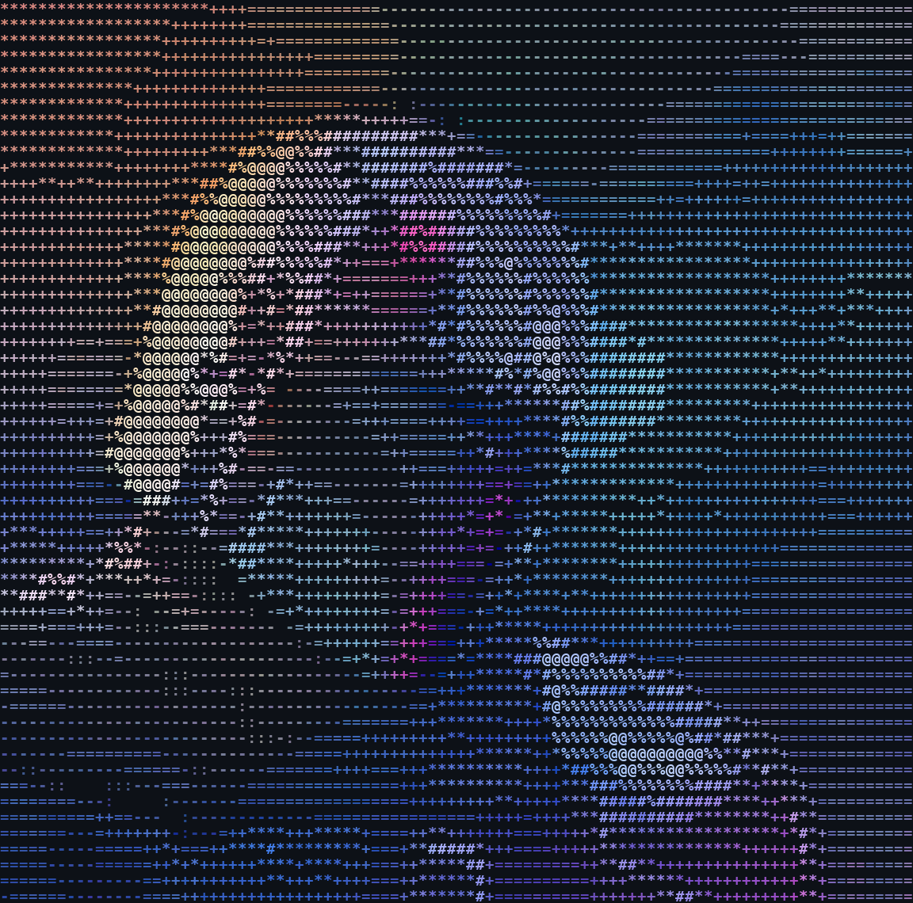

# DasToblerone

**Student &**
**hobby developer**

## About

I'm a student who builds software and games as a hobby. I like making tools that are fast to set up and easy to use, and I'm learning by building real projects.

## Currently working on

🚧 A free, open-source Minecraft server management panel, which has no name yet (AGPL-3.0).

- Each server runs isolated in its own Docker container
- Focus on fast installation and a simple setup
- Built with React + TypeScript on the frontend
- Status: early development, repository is private for now

## Skills

| Level | Technologies |
|---|---|
| **Basics** |      |
| **Learning** |    |

## Contact

💬 [Discord](https://discord.com/users/915847489398140938)

<picture>
  <source media="(prefers-color-scheme: dark)" srcset="https://github-readme-stats.vercel.app/api?username=DasToblerone&show_icons=true&theme=radical&hide_border=true&bg_color=0d1117">
  
</picture>
<picture>
  <source media="(prefers-color-scheme: dark)" srcset="https://github-readme-stats.vercel.app/api/top-langs/?username=DasToblerone&layout=compact&theme=radical&hide_border=true&bg_color=0d1117">
  
</picture>

